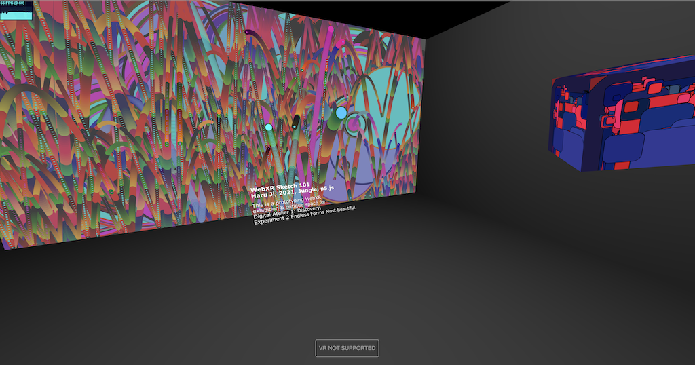

# WebXR_P5js_eCampus21

WebXR_P5js is a template for embedding [P5.js](https://p5js.org/) sketches inside a [Three.js](https://threejs.org/) WebXR-ready scene for VR and desktop display. The project is officially hosted on [Github](https://github.com/worldmaking/WebXR_P5js_eCampus21). A demo project using the template can be seen at [https://alicelab.world/WebXR_P5js_eCampus21/](https://alicelab.world/WebXR_P5js_eCampus21/)  



### Sister Projects

This is one of three projects developed in parallel by OCAD University and York University researchers with the goal of providing students of varying educational backgrounds and skillsets with the necessary toolkits to quickly produce WebXR envrironments for their creative media projects:

- [WebXR Template for P5.js](https://github.com/worldmaking/WebXR_P5js_eCampus21)
- [WebXR Template for A-Frame](https://github.com/ocadwebxr/ocadu-open-webxr)
- [WebXR Template for Three.js and Node.js](https://github.com/worldmaking/WebXRNodeLab_eCampus21)

## Acknowledgements

This project is made possible with funding by the Government of Ontario and through eCampusOntario’s support of the Virtual Learning Strategy. To learn more about the Virtual Learning Strategy visit: https://vls.ecampusontario.ca.

## License

WebXR_P5js_eCampus21 by [Haru Ji and Graham Wakefield](https://artificialnature.net) and is licensed under the GNU General Public License v3.0, except where otherwise noted.

[Three.js is shared under the MIT license](https://github.com/mrdoob/three.js/blob/dev/LICENSE)

# Manual

This guide is a detailed guide on how to prepare a WebXR gallery space of P5.js sketches. 

## Getting started

The easiest way to get started is to fork this Github repository, and begin editing the `index.html` file in the `gh-pages` branch of the repository. The `gh-pages` branch will be publicly hosted at a secure web address that is dervied from your Github username and projectname as follows:

`https://<username>.github.io/<projectname>`

It may take a few minutes for edits to appear at this address. 

Once you have your fork of the project, you can clone the repository and make changes to `index.html` or `template.html` to add your scripts as described below, then use `git` tools (desktop software or command line) to `commit` and `push` your updated project to your live website. 

## The template

The `template.html` template is an HTML5 page with a standard structure for embedding Javascript code. 

```html
<!DOCTYPE html>
<html lang="en">
<html>
<head>
<title></title>
<meta charset="UTF-8" />
<style>
/* ensure the content fills the available page without borders */
* { margin: 0px; }
</style>
</head>
<body>
<script type="module">
import { showArtwork, scene, renderer } from './webxrp5.js';

/// YOUR CODE HERE

</script>
</body>
</html>
</html>
```

## Staging Assets

For any assets (such as image files) to be available to the scene, they should be hosted in the same location as the HTML file, or referenced from a separate URL on a server that permits Cross-Origin Resource Sharing (CORS).

For example, in the demo at `index.html`, the 4th project uses an image instead of a P5.js script. The image is a JPG file hosted here in the same repository in the `assets` folder, and is loaded in the script by using the path `./assets/atelier.jpg`:

```javascript
let group3 = showArtwork({
	width: 3,
	height: 2,
	image: './assets/atelier.jpg',
	label: label3,
});
group3.position.set(-4, 0, 0);
group3.rotation.y = Math.PI / 2;
scene.add(group3);
```

To add new assets to your project, they will also need to be uploaded via the Github 'add file' interface, or committed via git desktop or command line tools.