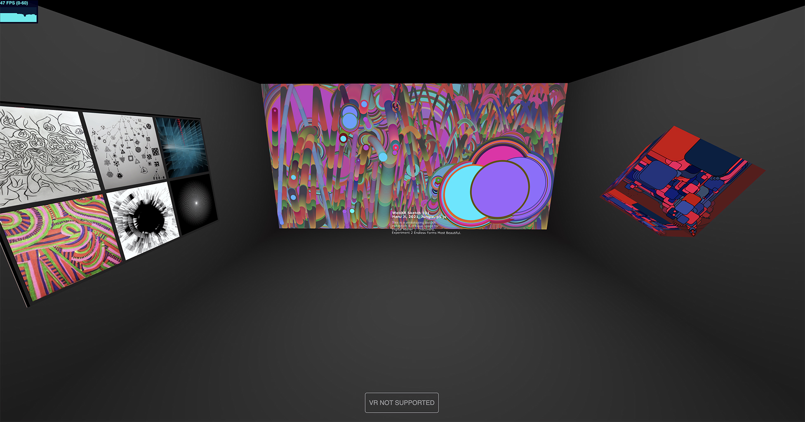

# WebXR_P5js_eCampus21

WebXR_P5js is a template for embedding [P5.js](https://p5js.org/) sketches inside a [Three.js](https://threejs.org/) WebXR-ready scene for VR and desktop display. The project is officially hosted on [Github](https://github.com/worldmaking/WebXR_P5js_eCampus21). A demo project using the template can be seen at [https://alicelab.world/WebXR_P5js_eCampus21/](https://alicelab.world/WebXR_P5js_eCampus21/)  



Image displays a screenshot view of the demo WebXR exhibition space. If a VR headset is available on the computer and supported by the browser, it will show the "Enter VR" option to view the space in VR.

### Sister Projects

This is one of three projects developed in parallel by OCAD University and York University researchers with the goal of providing students of varying educational backgrounds and skillsets with the necessary toolkits to quickly produce WebXR envrironments for their creative media projects:

- [WebXR Template for P5.js](https://github.com/worldmaking/WebXR_P5js_eCampus21)
- [WebXR Template for A-Frame](https://github.com/ocadwebxr/ocadu-open-webxr)
- [WebXR Template for Three.js and Node.js](https://github.com/worldmaking/WebXRNodeLab_eCampus21)

## Acknowledgements

This project is made possible with funding by the Government of Ontario and through eCampusOntario’s support of the Virtual Learning Strategy. To learn more about the Virtual Learning Strategy visit: https://vls.ecampusontario.ca.

## License

WebXR_P5js_eCampus21 by [Haru Ji and Graham Wakefield](https://artificialnature.net) and is licensed under the GNU General Public License v3.0, except where otherwise noted.

[Three.js is shared under the MIT license](https://github.com/mrdoob/three.js/blob/dev/LICENSE)

# Manual

This guide is a detailed guide on how to prepare a WebXR gallery space of P5.js sketches. 

## Getting started

The easiest way to get started is to fork this Github repository, and begin editing the `index.html` file in the `gh-pages` branch of the repository. The `gh-pages` branch will be publicly hosted at a secure web address that is dervied from your Github username and projectname as follows:

`https://<username>.github.io/<projectname>`

It may take a few minutes for edits to appear at this address. 

Once you have your fork of the project, you can clone the repository and make changes to `index.html` or `template.html` to add your scripts as described below, then use `git` tools (desktop software or command line) to `commit` and `push` your updated project to your live website. 

## The template

The `template.html` template is an HTML5 page with a standard structure for embedding Javascript code. 

```html
<!DOCTYPE html>
<html lang="en">
<html>
<head>
<title></title>
<meta charset="UTF-8" />
<style>
/* ensure the content fills the available page without borders */
* { margin: 0px; }
</style>
</head>
<body>
<script type="module">
import { showArtwork, scene } from './webxrp5.js';

/// YOUR CODE HERE

</script>
</body>
</html>
</html>
```

The template is a standard HTML5 boilerplate, embedding a JavaScript inline module that imports the WebXR_P5.js library's `showArtwork` function, and the Three.js [`scene`](https://threejs.org/docs/#api/en/scenes/Scene) object.

## showArtwork()

To add artwork to the template you can call the `showArtwork()` function. 

This is the function to turn an image file or a p5.js script into an object in Three.js.

The `showArtwork()` call should pass in an "options" object that configures how the artwork is displayed. 

It returns a Three.js [Group](https://threejs.org/docs/?q=group#api/en/objects/Group) object, which you can place in the world as desired. 

The argument to this function is a JavaScript object with one required field
and a few optional ones:

```javascript
{
	// REQUIRED -- either of:
	// code: <string of your p5.js code>, OR
	// image: <URL to a public image>,

	// RECOMMENDED:
	// width: <optional, in meters, defaults to 5m>,
	// height: <optional, in meters, defaults to 3m>,
	// label: <optional string: label for the artwork>,

	// OPTIONAL:
	// depth: <optional, in meters, defaults to 0.01m>,
	// resolution: <optional, pixels per meter, defaults to 250>
	// update: <Javascript function, which can be used to animate the object>
}
```

### Code

To embed a P5.js script, the source code of the script needs to be added to the options object under the `code` field. 

However, there are some edits that you must make to the P5.js code.

- The p5.js script here must have a `draw()` function, but **no `setup()`** function. 
- Any setup of resources and variables should be in global code in the script. 
- Do not call `createCanvas()`, as the `showArtwork()` method is creating the canvas for you. 

#### Some limitations

Currently, mouse, keyboard, etc. events are not supported, and external libraries (e.g. audio) will probably not work. 

Example:

```javascript
showArtwork({
	code: `
	draw() {
		background(0, 15);
	}
	`
})
```

#### Static images instead of P5.js code

Instead of displaying a P5.js script, you can display a static image, using the `image` field option. See the notes below on Staging Assets for an example. 

### Dimensions

The `width` and `height` fields define the size of the canvas in meters. 

The `depth` field sets the depth of the canvas as a 3D object. Setting `width`, `height`, and `depth` to the same number will create a cube. 

The `resolution` field defines the resolution of the canvas, in pixels per meter. E.g., if the resolution is 100, and the canvas is 2m x 3m, then the canvas will be 200 x 300 pixels. 

### Labels

The options object can include a text string `label` to show the title and description of the artwork. This text will fade in when the visitor looks down toward the bottom of the artwork, and fade out again when the visitor looks back up. 

### Animation

If you want the canvas to animate in the 3D world, you can add an `update` field to the options object with a JavaScript function. The argument to the `update` function is the Three.js [Group](https://threejs.org/docs/?q=group#api/en/objects/Group) that contains the artwork. 

For example, the code below creates a cube object textured by the P5.js script, and continuously rotates this object in the 3D world:

```javascript
let artwork = showArtwork({
	// show artwork on a one-meter cube:
	width: 1,
	height: 1,
	depth: 1,
	// the artwork code goes here:
	code: code1,
	// the update routine will animate the artwork
	update: function (artwork) {
		artwork.rotation.y += 0.01;
		artwork.rotation.x += 0.003;
	},
});
artwork.position.set(3.5, 0, 0);
```

### Performance

For VR it is very important to maintain high framerates to avoid latency that can cause nausea or cybersickness. 

The WebXR_P5.js scene will only animate one script at once -- whichever one the visitor has most recently looked at. 

However it is still important for the designer to ensure the P5.js script is efficient and able to run at high frame rates (90 FPS recommended for VR). 

Reducing the `resolution` of the canvas may be one way to improve performance. 

### Placing the Artwork in the World

The Three.js [Group](https://threejs.org/docs/?q=group#api/en/objects/Group) returned by `showArtwork()` should normally be at Y=0 to have it align properly, but you can position it in X and Z components (e.g. using `group.position.set(x, 0, z)`) and rotate it (e.g. using `group.rotation.y = Math.PI/2`) to position and orient the work in the world.

For example:

```javascript
let group2 = showArtwork({
	width: 3,
	height: 3,
	code: code2,
	label: label2,
});
group2.position.set(0, 0, 4);
group2.rotation.y = Math.PI;
```

## Staging Assets

For any assets (such as image files) to be available to the scene, they should be hosted in the same location as the HTML file, or referenced from a separate URL on a server that permits Cross-Origin Resource Sharing (CORS).

For example, in the demo at `index.html`, the 4th project uses an image instead of a P5.js script. The image is a JPG file hosted here in the same repository in the `assets` folder, and is loaded in the script by using the path `./assets/atelier.jpg`:

```javascript
let group3 = showArtwork({
	image: './assets/atelier.jpg',
	width: 3,
	height: 2,
	label: label3,
});
group3.position.set(-4, 0, 0);
group3.rotation.y = Math.PI / 2;
scene.add(group3);
```

To add new assets to your project, they will also need to be uploaded via the Github 'add file' interface, or committed via git desktop or command line tools.
